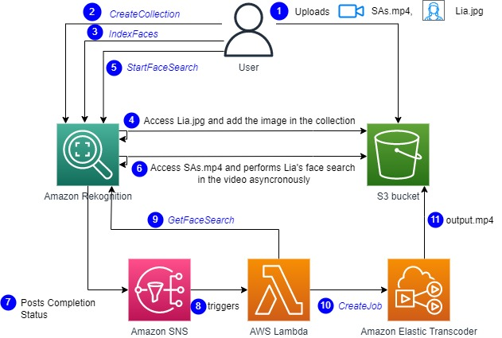
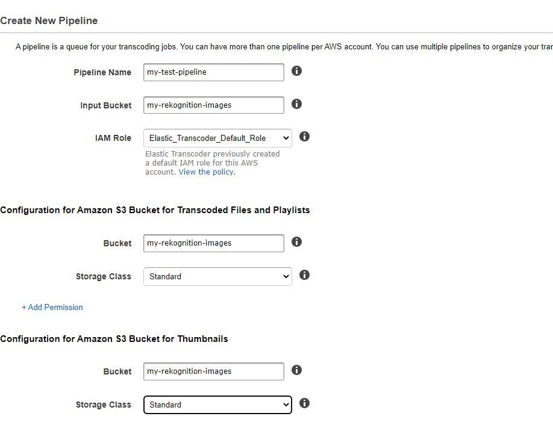
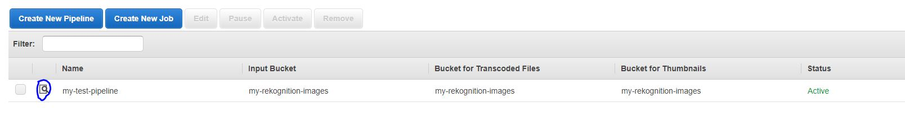

## Automate Video Editing by just taking in the snippets for a particular actor/speaker

For a whole video contaning many actors/speakers, we can just pull out snippets and create a video with those snippets so that it contains content from a single speaker/actor

## Reference Architecture


## Pre-requisites:

1. Have aws-cli installed

This is done in below Steps:

1. Create an s3 bucket manually and give a name. eg we are naming it : `my-rekognition-images`
1. Add the video and referenced image that need to be searched in the video in the above created bucket. For this example I am uploading a video `SAs.mp4` and `Lia.JPG`
1. Create an Elastic Transcoder Pipeline and provide the above s3 bucket as shown below:
    
1. Note the pipeline id by clicking the 'search icon' as shown below
    

1. Set up the infrastructure by launching the template in CloudFormation in your aws account and specify the `pieline-id` you got from step 3.
    1. Note the `SNSArn` and `RekognitionSNSPublishRoleArn` from the `Output` section in the CloudFormation stack

1. Run the below commands in aws-cli
    1. **Create a collection**
    ```hcl
    aws rekognition create-collection --collection-id my-collection --region ap-southeast-2
    ```

    1. **Add image/face to be indexed**
    ```hcl
    aws rekognition index-faces --collection-id my-collection --image "S3Object={Bucket=my-rekognition-images,Name=Lia.JPG}" --external-image -id Lia --region ap-southeast-2
    ```

    1. **Start the face search in the video**
    ```hcl
    aws rekognition start-face-search --video "S3Object={Bucket=my-rekognition-images,Name=SAs.mp4}" --collection-id my-collection --notification-channel '{\"SNSTopicArn\":\"<sns-topic-arn-at-5th-step>\", \"RoleArn\":\"<role-arn-at-5th-step>\"}' --region ap-southeast-2
    ```
    This is an asyncronous process and once the job is done, it will trigger the SNS topic which in turn triggers the lambda function which will do the job for us and the output video `output.mp4` will be uploaded in the `my-rekognition-images` s3 bucket

## Security

See [CONTRIBUTING](CONTRIBUTING.md#security-issue-notifications) for more information.

## License

This library is licensed under the MIT-0 License. See the LICENSE file.

